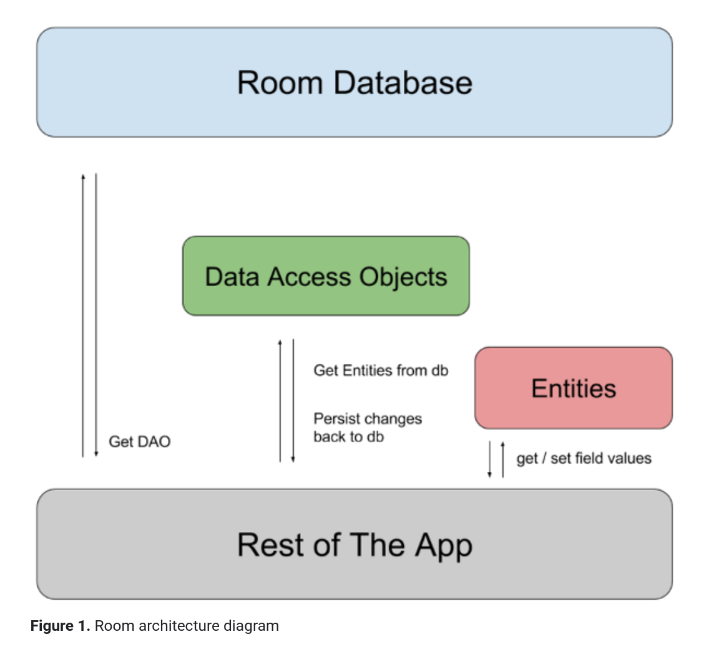

= Jetpack-Compose with Roomn
Florentin Gewessler
1.0, 2020-11-19
ifndef::sourcedir[:sourcedir: ../src/main/java]
ifndef::imagesdir[:imagesdir: images]
ifndef::backend[:backend: html5]
:icons: font

== State Management in Jetpack Compose

image::state_archi.png[]

source: https://developer.android.com/jetpack/compose/state

== Navigation

How it has been done

image::old_nav.png[]

source: https://developer.android.com/guide/navigation/navigation-getting-started

=== New Approach

image::new_approach.png[]

== Room

Room persistence library is a database library which allows us to quickly and easily create SQLite databases and perform the database operations.

=== Room Architecture

source: https://developer.android.com/training/data-storage/room

== Example

NVS-Student-App

== Advanced Jetpack Compose App

Jetpack Compose example from Google

== Sources

* https://developer.android.com/jetpack/compose/mental-model
* https://localazy.com/blog/floating-windows-on-android-1-jetpack-compose-and-room
* https://developer.android.com/topic/libraries/architecture/room?gclid=Cj0KCQiAqdP9BRDVARIsAGSZ8AnMr5iljKPBk6qReWxAhrmSmj6c-wh-ySzDtSFCiFZ-8g0FegkY7KkaAhDyEALw_wcB&gclsrc=aw.ds
* https://www.youtube.com/channel/UCVHFbqXqoYvEWM1Ddxl0QDg